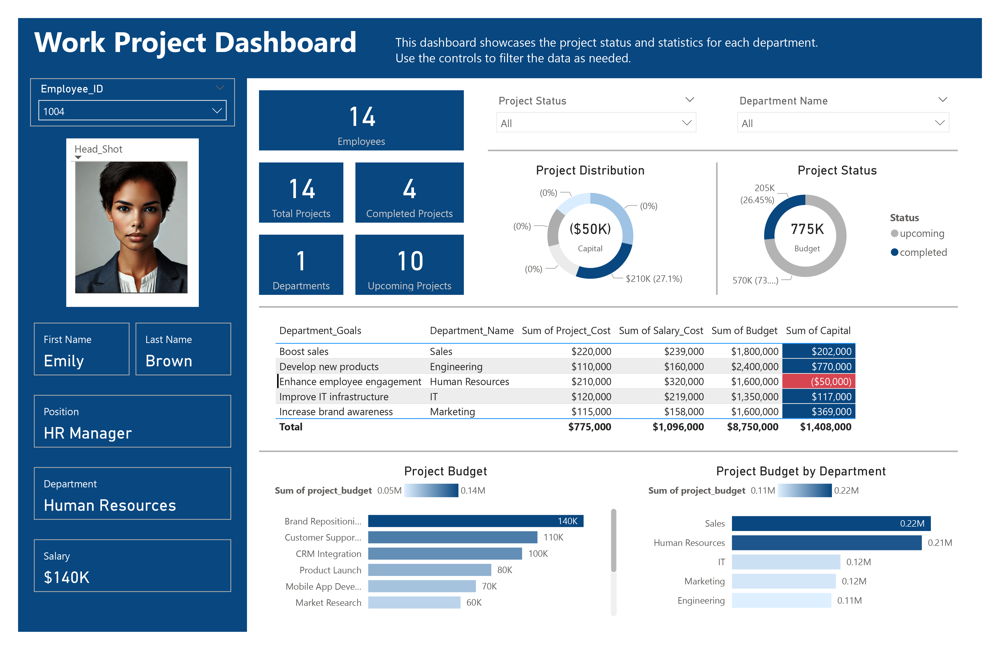

# 🚀 Quanta Technologies Workforce & Project Dashboard Analysis

## 📊 Executive Summary

This Power BI dashboard provides real-time visibility into Quanta Technologies’ workforce costs, project budgets, and departmental performance. Key findings reveal:

- 🛑 **Human Resources** is **$50K over budget** due to high salary costs relative to project returns.
- 🏗 **Engineering** has the highest capital expenditure (**$770K**) but aligns with its **“Develop new products”** goal.
- 📈 **10 upcoming projects** (vs. **4 completed**) indicate a busy pipeline, with **Sales and HR dominating budget allocations**.

## 🔍 Key Insights

### 1️⃣ Departments at Financial Risk

| 📌 Department     | 💰 Budget  | 💵 Salary Cost | 📊 Project Cost | 🏦 Capital  | ⚠️ Status            |
|-------------------|---------|-------------|--------------|----------|------------------|
| 🏢 Human Resources  | $1.6M   | $320K       | $210K        | ($50K)   | ❗ Over budget    |
| 🏗 Engineering      | $2.4M   | $160K       | $110K        | $770K    | ✅ On track (R&D focus) |
| 📈 Sales           | $1.8M   | $239K       | $220K        | $202K    | ⚠️ Monitor project ROI |

#### ⚠️ Risk Analysis:
- **HR’s salary costs ($320K) exceed project returns ($210K)**, creating a **$50K capital deficit**.
- **Sales projects consume 12.2% of the total budget** but lack visibility into ROI (e.g., *“Brand Repositioning” at $140K*).

🔹 **🛠 Recommendations:**
- 📌 Audit HR’s high salary spend (e.g., overtime, headcount).
- 📊 Tie Sales budgets to revenue targets (e.g., CRM Integration’s impact on conversions).

### 2️⃣ Project Budget Allocation

#### 🏆 **Top 3 Projects by Budget:**
1. 🎯 **Brand Repositioning** ($140K | Marketing)
2. 📞 **Customer Support Upgrade** ($110K | Sales)
3. 🏢 **CRM Integration** ($100K | Sales)

#### 🚨 **Concerns:**
- **⚡ 70% of projects are “upcoming”**—potential for scope creep or delays.
- **🔗 No clear link between budgets and department goals** (e.g., Engineering’s **$770K capital vs. $110K project spend**).

🔹 **📢 Recommendations:**
- 📅 Implement **quarterly budget reviews** to align project spend with annual goals.
- 📌 Add **KPIs to track project health** (e.g., timeline adherence, deliverable quality).

### 3️⃣ Workforce Cost vs. Productivity

- 💰 **HR has the highest salary cost ($320K)** but the **lowest capital return**.
- 🏗 **Engineering achieves high capital output ($770K) with moderate salaries ($160K)**—a model for efficiency.

🔹 **🔄 Recommendations:**
- 🔀 Cross-train HR staff to support revenue-generating projects (e.g., hiring for Sales/Engineering).
- 🔧 Reallocate surplus Engineering capital to underfunded IT infrastructure projects.

## 📊 Dashboard Features

✅ **Interactive Filters:** Drill down by department/project status.  
✅ **Budget vs. Actuals:** 📊 Color-coded alerts for overspending.  
✅ **Employee-Level Data:** 🏢 Track roles, salaries, and departments (e.g., *Emily Brown, HR Manager, $140K*).  

## 🎯 Strategic Recommendations

### 🏦 Mitigate HR’s Budget Deficit:
- 🛑 Freeze non-essential hires or shift tasks to lower-cost roles.

### 🏗 Optimize Engineering’s R&D Spend:
- 🔄 Allocate **$200K of its $770K capital** to IT infrastructure upgrades.

### 🚀 Enhance Project Governance:
- 🔍 Add a **“Risk Score” metric** to the dashboard for upcoming projects.

## 🏁 Conclusion

This dashboard highlights **actionable cost-saving opportunities** while ensuring **strategic projects stay on track**.

### 📌 Next Steps:
- 📊 **Integrate revenue data** to measure project ROI.
- 🔔 **Automate alerts** for budget thresholds.
